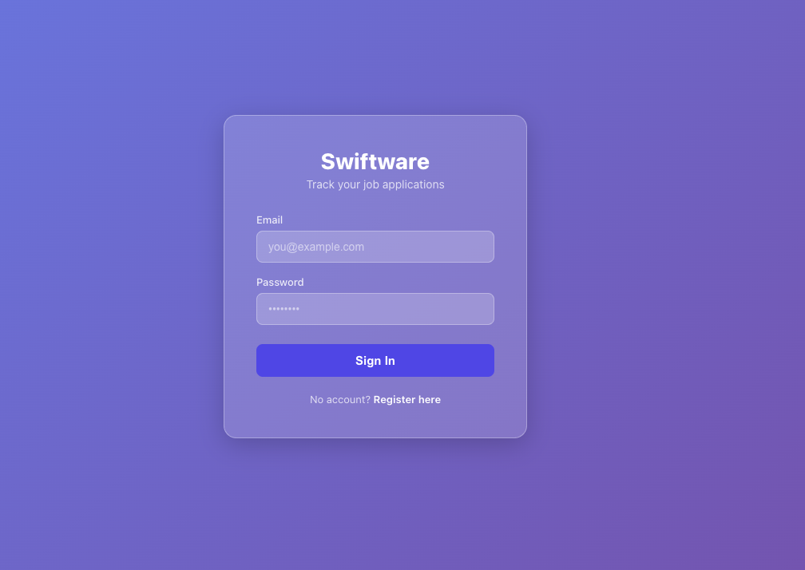

# swiftware

# Swiftware Job Tracker

A full stack MERN job application tracker built to help developers manage their job search across 500+ tech companies.

## Live Demo

🔗 **App:** https://swiftware-k9yn.vercel.app  
🔗 **API:** https://swiftware-omega.vercel.app

## Screenshots



## Features

- 🔐 **JWT Authentication** — secure register, login, logout
- 📊 **Live Dashboard** — real-time stats tracking applied, interviews, offers and rejections
- 🏢 **501 Pre-loaded Companies** — Seattle, Bellevue, Kirkland, Redmond and remote tech companies
- 🔍 **Search & Filter** — search by company, location, or type. Filter by application status
- ✏️ **Status Tracking** — update application status with color-coded badges
- ➕ **Add Jobs** — add new companies via modal form
- 🌙 **Dark Mode** — persistent theme preference saved to localStorage
- 📱 **Mobile Friendly** — responsive design works on all screen sizes

## Tech Stack

### Frontend

- React 18 + Vite
- React Router v6
- Axios
- React Hot Toast
- CSS Modules

### Backend

- Node.js + Express
- MongoDB Atlas + Mongoose
- JWT Authentication
- bcryptjs

### Deployment

- Vercel (frontend + backend)
- MongoDB Atlas (database)

## Project Structure

```
swiftware/
├── backend/
│   ├── models/
│   │   ├── User.js
│   │   └── Job.js
│   ├── routes/
│   │   ├── auth.js
│   │   └── jobs.js
│   ├── middleware/
│   │   └── auth.js
│   ├── seed.js
│   └── server.js
└── frontend/
    └── src/
        ├── api/
        │   └── axios.js
        ├── components/
        │   ├── PrivateRoute.jsx
        │   └── AddJobModal.jsx
        ├── context/
        │   ├── AuthContext.js
        │   ├── AuthProvider.jsx
        │   ├── useAuth.js
        │   ├── ThemeContext.jsx
        │   ├── ThemeProvider.jsx
        │   └── useTheme.js
        └── pages/
            ├── Login.jsx
            ├── Register.jsx
            ├── Dashboard.jsx
            └── Jobs.jsx
```

## API Endpoints

| Method | Endpoint             | Description           | Auth |
| ------ | -------------------- | --------------------- | ---- |
| POST   | `/api/auth/register` | Create new account    | ❌   |
| POST   | `/api/auth/login`    | Login and get token   | ❌   |
| GET    | `/api/jobs`          | Get all jobs for user | ✅   |
| POST   | `/api/jobs`          | Add a new job         | ✅   |
| PUT    | `/api/jobs/:id`      | Update job status     | ✅   |
| DELETE | `/api/jobs/:id`      | Delete a job          | ✅   |
| GET    | `/api/jobs/stats`    | Get stats by status   | ✅   |

## Getting Started

### Prerequisites

- Node.js v18+
- MongoDB Atlas account
- Git

### Clone the repo

```bash
git clone https://github.com/rudyravelindev/swiftware.git
cd swiftware
```

### Backend Setup

```bash
cd backend
npm install
```

Create a `.env` file in the backend folder:

```
MONGO_URI=your_mongodb_atlas_connection_string
JWT_SECRET=your_jwt_secret_key
PORT=8000
```

Start the backend:

```bash
npm run dev
```

### Frontend Setup

```bash
cd frontend
npm install
```

Create a `.env.local` file in the frontend folder:

```
VITE_API_URL=http://localhost:8000/api
```

Start the frontend:

```bash
npm run dev
```

Open `http://localhost:5173` in your browser.

### Seed the database (optional)

To import 501 tech companies into your database:

```bash
cd backend
node seed.js
```

## Job Status Types

| Status         | Description                       |
| -------------- | --------------------------------- |
| 🔵 Not Applied | Company saved but not yet applied |
| 🔷 In Progress | Application in progress           |
| 🟣 Applied     | Application submitted             |
| 🟡 Interview   | Interview scheduled or completed  |
| 🟢 Offer       | Offer received                    |
| 🔴 Rejected    | Application rejected              |

## Environment Variables

### Backend

| Variable     | Description                     |
| ------------ | ------------------------------- |
| `MONGO_URI`  | MongoDB Atlas connection string |
| `JWT_SECRET` | Secret key for JWT signing      |
| `PORT`       | Server port (default 8000)      |

### Frontend

| Variable       | Description          |
| -------------- | -------------------- |
| `VITE_API_URL` | Backend API base URL |

## Author

**Rudy Ravelin**  
MERN Stack Developer  
📍 Kirkland, WA  
🔗 [LinkedIn](https://linkedin.com/in/rudyravelin)  
🔗 [GitHub](https://github.com/rudyravelindev)

## License

MIT
